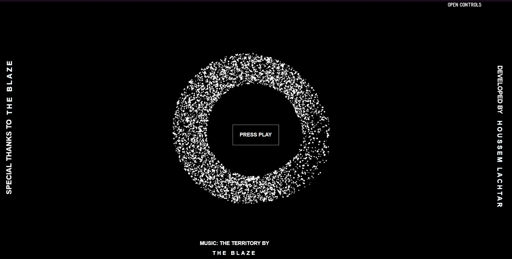

# Wavy-Sounds
<p align="center">
Play Music With Self-controlled Animation
<br>
<a href="https://houssemlachtar.github.io/Wavy-Sounds/">
        
    </a>
<br>
<a href="https://houssemlachtar.github.io/Wavy-Sounds/">
        Demo
    </a>
</p>

## Installation
(Open the project in VS Code, Run the terminal and type)<br>
Install dependencies:

```
npm install
```

Compile the code for development and start a local server:

```
npm start
```

Create the build:

```
npm run build
```

## Follow me on

[Instagram](https://www.instagram.com/houssem_lachtar/), [Codepen](https://codepen.io/houssem-lachtar), [GitHub](https://github.com/houssemlachtar)


